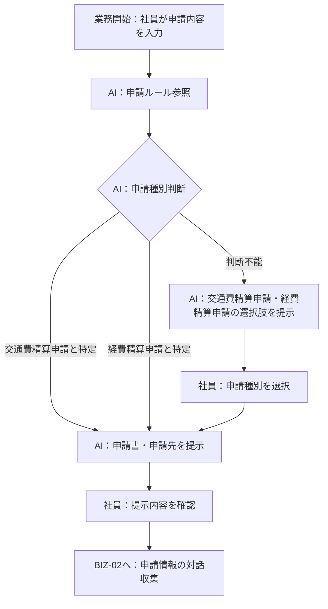

> **参照元（入力資料）:**
> - 業務要件一覧.md（業務要件ID・業務種別の特定）
> - 業務一覧.md（業務ID・業務名の特定）
> - 役割分担定義.md（実行主体・責務分担の決定）
> - 業務ルール定義_判断基準定義.md（判断・ルールとの紐付け）

## 業務プロセス定義

---

### 基本情報
- 業務ID：BIZ-01
- 業務名：申請種別案内・申請書提示
- 業務目的：社員が入力した申請内容から必要な申請種別・申請書・申請先をAIが判断して提示する
- 対象ユーザ：全社員
- 開始条件（トリガー）：社員が申請したい内容をシステムに入力する
- 終了条件：AIが申請種別・申請書・申請先を社員に提示し、社員が確認する

### 業務フロー（To-Be）

## 業務ステップ定義：ST-01

### 1) 基本情報
- ステップID：ST-001-01
- ステップ名：申請内容の入力
- 対応業務ID：BIZ-01
- 対応プロセスID：BIZ-01
- ステップ種別：入力
- 実行主体：
  - ☑ 人
  - ☐ AIエージェント
  - ☐ 人＋AI（協調）

### 2) ステップ概要
- 目的：社員が申請したい内容をシステムに入力する
- このステップで達成すること：申請意図テキストを取得する
- 業務上の意味：AIによる申請種別判断のトリガーとなる入力を受け付ける

### 3) フロー上の位置

- 直前ステップ：なし（業務開始）
- 直後ステップ（通常）：ST-001-02（申請ルール参照・申請種別判断）
- 分岐先ステップ（条件付き）：なし

### 4) 入力情報

| データID | データ名 | 取得元 | 必須 | 欠落時対応 |
|---|---|---|---:|---|
| D-001 | 申請内容テキスト | 社員入力 | ○ | 再入力要求 |

### 5) 実施内容

#### 5.1 処理概要
- 実施する業務処理：社員が申請したい内容を自然言語でシステムに入力する

#### 5.2 処理詳細（業務粒度）
1. 社員がシステムのインターフェースにアクセスする
2. 申請したい内容を自然言語テキストで入力する（例：「タクシー代を精算したい」「ホテルの宿泊費を精算したい」）
3. 入力内容をシステムに送信する

### 6) 判断・ルール

| 種別 | ID | 利用方法 |
|---|---|---|
| 業務ルール | BRL-01 | 入力された申請内容を申請種別判断に使用することを確認する |

### 7) 出力結果

| データID | データ名 | 出力先 | 確定主体 |
|---|---|---|---|
| D-001 | 申請内容テキスト | ST-001-02 | 人 |

### 8) 例外処理

| ケース | 発生条件 | 対応 | 遷移先 |
|---|---|---|---|
| 入力内容が空の場合 | 社員が何も入力せず送信した場合 | 再入力を促すメッセージを表示する | ST-001-01（再実行） |

### 9) 責務分担

| 項目 | 人 | AIエージェント |
|---|---|---|
| 入力 | ○ | × |
| 判断 | ○（入力内容の決定） | × |
| 実行 | ○ | × |

### 10) 完了条件
- 正常終了条件：申請内容テキストが入力・送信された
- 未完了・中断条件：社員がシステムを離脱した

---

## 業務ステップ定義：ST-02

### 1) 基本情報
- ステップID：ST-001-02
- ステップ名：申請ルール参照・申請種別判断
- 対応業務ID：BIZ-01
- 対応プロセスID：BIZ-01
- ステップ種別：判断・実行
- 実行主体：
  - ☐ 人
  - ☑ AIエージェント
  - ☐ 人＋AI（協調）

### 2) ステップ概要
- 目的：社内申請ルールを参照し、入力内容に対応する申請種別を判断する
- このステップで達成すること：申請種別の特定（交通費精算申請 または 経費精算申請）または判断不能時の選択肢提示
- 業務上の意味：社員が正しい申請書を選択できるよう、AIが申請ルールの参照・解釈を代行する

### 3) フロー上の位置

- 直前ステップ：ST-001-01（申請内容の入力）
- 直後ステップ（通常）：ST-001-03（申請種別・申請書提示）
- 分岐先ステップ（条件付き）：
  - JD-02（判断不能）→ 社員に選択肢（交通費精算申請 / 経費精算申請）を提示し、選択後にST-001-03へ

### 4) 入力情報

| データID | データ名 | 取得元 | 必須 | 欠落時対応 |
|---|---|---|---:|---|
| D-001 | 申請内容テキスト | ST-001-01 | ○ | 前ステップへ戻る |
| D-002 | 社内申請ルール | ナレッジベース | ○ | エスカレーション |

### 5) 実施内容

#### 5.1 処理概要
- 実施する業務処理：社内申請ルールを参照し、申請内容に対応する申請種別を判断する

#### 5.2 処理詳細（業務粒度）
1. 社内申請ルール（ナレッジベース）を参照する
2. 申請内容テキストを申請ルールの適用条件と照合する
3. 交通費精算申請または経費精算申請のいずれかを特定する（特定・判断不能のいずれかを判断する）
4. 判断不能の場合は「交通費精算申請」「経費精算申請」の選択肢を社員に提示し、選択に従って申請種別を確定する

### 6) 判断・ルール

| 種別 | ID | 利用方法 |
|---|---|---|
| 業務ルール | BRL-01 | 申請ルールを参照して申請種別を判断するために使用する |
| 業務ルール | BRL-06 | 判断不能時に選択肢を提示し社員に選択を促すために使用する |
| 判断基準 | JD-01 | 申請種別が特定できた場合に適用する |
| 判断基準 | JD-02 | 申請種別の判断が不能な場合に適用する |

### 7) 出力結果

| データID | データ名 | 出力先 | 確定主体 |
|---|---|---|---|
| D-003 | 申請種別判断結果（種別名・根拠・判断ステータス） | ST-001-03 | AI |

### 8) 例外処理

| ケース | 発生条件 | 対応 | 遷移先 |
|---|---|---|---|
| ナレッジベース参照失敗 | 社内申請ルールを参照できない場合 | エラーを社員に通知し、担当部門への問い合わせを案内する | 業務終了（エスカレーション） |

### 9) 責務分担

| 項目 | 人 | AIエージェント |
|---|---|---|
| 入力 | × | ○ |
| 判断 | × | ○（申請種別の特定） |
| 実行 | × | ○ |

### 10) 完了条件
- 正常終了条件：申請種別判断結果（種別・根拠・ステータス）が確定した（社員による選択を含む）
- 未完了・中断条件：ナレッジベース参照エラーが発生した

---

## 業務ステップ定義：ST-03

### 1) 基本情報
- ステップID：ST-001-03
- ステップ名：申請種別・申請書・申請先の提示
- 対応業務ID：BIZ-01
- 対応プロセスID：BIZ-01
- ステップ種別：案内
- 実行主体：
  - ☐ 人
  - ☑ AIエージェント
  - ☐ 人＋AI（協調）

### 2) ステップ概要
- 目的：判断結果（申請種別・申請書・申請先）を社員に提示する
- このステップで達成すること：社員が必要な申請書と申請先を認識する
- 業務上の意味：社員が申請手続きを正しく進められるよう案内する

### 3) フロー上の位置

- 直前ステップ：ST-001-02（申請ルール参照・申請種別判断）
- 直後ステップ（通常）：BIZ-02（申請情報の対話収集）
- 分岐先ステップ（条件付き）：ST-001-02（判断不能の場合、社員が選択した後に再度申請種別を確定する）

### 4) 入力情報

| データID | データ名 | 取得元 | 必須 | 欠落時対応 |
|---|---|---|---:|---|
| D-003 | 申請種別判断結果 | ST-001-02 | ○ | 前ステップへ戻る |

### 5) 実施内容

#### 5.1 処理概要
- 実施する業務処理：申請種別・申請書名・申請先を社員に提示し、確認を促す

#### 5.2 処理詳細（業務粒度）
1. 申請種別判断結果を取得する
2. 申請種別・申請書名・申請先・判断根拠を整形して社員に提示する

### 6) 判断・ルール

| 種別 | ID | 利用方法 |
|---|---|---|
| 業務ルール | BRL-02 | 判断結果と根拠を提示する際に適用する |

### 7) 出力結果

| データID | データ名 | 出力先 | 確定主体 |
|---|---|---|---|
| D-004 | 申請種別案内（申請種別名・申請書名・申請先・根拠） | 社員への表示 / BIZ-02 | AI |

### 8) 例外処理

| ケース | 発生条件 | 対応 | 遷移先 |
|---|---|---|---|
| 申請種別の判断が不能な場合 | JD-02が適用された場合 | 「交通費精算申請」「経費精算申請」の選択肢を社員に提示し選択を促す（ST-001-02で処理） | ST-001-02（選択肢提示） |

### 9) 責務分担

| 項目 | 人 | AIエージェント |
|---|---|---|
| 入力 | × | ○ |
| 判断 | × | ○（提示内容の生成） |
| 実行 | 最終（確認・受け入れ） | ○（提示） |

### 10) 完了条件
- 正常終了条件：申請種別・申請書・申請先が社員に提示された
- 未完了・中断条件：申請種別が確定せず社員がシステムを離脱した

---

## 業務ステップ定義：ST-04（BIZ-02）

### 1) 基本情報
- ステップID：ST-002-01
- ステップ名：不足情報の特定と対話収集
- 対応業務ID：BIZ-02
- 対応プロセスID：BIZ-02
- ステップ種別：対話・確認
- 実行主体：
  - ☐ 人
  - ☐ AIエージェント
  - ☑ 人＋AI（協調）

### 2) ステップ概要
- 目的：申請書作成に必要な不足情報を対話形式で収集する
- このステップで達成すること：申請書作成に必要なすべての情報が揃う
- 業務上の意味：社員が申請フォームの項目を把握していなくても、対話によって正確な情報を収集できる

### 3) フロー上の位置

- 直前ステップ：ST-001-03（申請種別・申請書提示）
- 直後ステップ（通常）：ST-003-01（申請書の自動作成）
- 分岐先ステップ（条件付き）：情報収集ループ（不足がある間継続）

### 4) 入力情報

| データID | データ名 | 取得元 | 必須 | 欠落時対応 |
|---|---|---|---:|---|
| D-004 | 申請種別案内情報 | ST-001-03 | ○ | 前ステップへ戻る |
| D-005 | 申請種別ごとの必須項目定義 | ナレッジベース | ○ | エスカレーション |
| D-006 | 社員回答（対話入力） | 社員入力 | ○ | 再入力要求 |

### 5) 実施内容

#### 5.1 処理概要
- 実施する業務処理：申請書の必須項目のうち未収集のものを特定し、対話形式で確認・収集する

#### 5.2 処理詳細（業務粒度）
1. 申請種別に対応する必須項目を参照する
2. 不足している項目を特定する
3. 不足項目の確認質問を生成して社員に提示する
4. 社員の回答を受信・検証する
5. 必要情報がすべて揃うまでステップ3〜4を繰り返す

### 6) 判断・ルール

| 種別 | ID | 利用方法 |
|---|---|---|
| 業務ルール | BRL-03 | 不足情報を対話で収集するタイミングと条件に適用する |
| 判断基準 | JD-04 | 必要情報が揃ったかどうかの判断に適用する |
| 判断基準 | JD-05 | 不足情報が残る場合の継続収集判断に適用する |

### 7) 出力結果

| データID | データ名 | 出力先 | 確定主体 |
|---|---|---|---|
| D-007 | 収集済み申請情報（全必須項目の値） | ST-003-01 | 人＋AI |

### 8) 例外処理

| ケース | 発生条件 | 対応 | 遷移先 |
|---|---|---|---|
| 社員が情報提供を拒否した場合 | 必須項目の回答が得られない場合 | 申請書作成が完了できない旨を通知する | 業務終了 |
| 社員の回答が不明瞭な場合 | 入力内容から必要情報を抽出できない場合 | 再入力を促す質問を提示する | ST-002-01（継続） |

### 9) 責務分担

| 項目 | 人 | AIエージェント |
|---|---|---|
| 入力 | ○（回答） | ○（質問生成・情報収集） |
| 判断 | × | ○（不足項目特定・充足判断） |
| 実行 | ○（回答提供） | ○（対話進行） |

### 10) 完了条件
- 正常終了条件：申請書作成に必要なすべての情報が収集された
- 未完了・中断条件：社員が必須情報の提供を拒否した、または業務を中断した

---

## 業務ステップ定義：ST-05（BIZ-03）

### 1) 基本情報
- ステップID：ST-003-01
- ステップ名：申請書の自動作成
- 対応業務ID：BIZ-03
- 対応プロセスID：BIZ-03
- ステップ種別：参照・実行
- 実行主体：
  - ☐ 人
  - ☑ AIエージェント
  - ☐ 人＋AI（協調）

### 2) ステップ概要
- 目的：収集した情報をもとに申請書ドラフトを自動生成する
- このステップで達成すること：申請書ドラフトの生成
- 業務上の意味：社員が申請書フォーマットを把握・記入する手間を削減する

### 3) フロー上の位置

- 直前ステップ：ST-002-01（不足情報の特定と対話収集）
- 直後ステップ（通常）：ST-004-01（申請内容の事前チェック）
- 分岐先ステップ（条件付き）：なし

### 4) 入力情報

| データID | データ名 | 取得元 | 必須 | 欠落時対応 |
|---|---|---|---:|---|
| D-007 | 収集済み申請情報 | ST-002-01 | ○ | 前ステップへ戻る |
| D-008 | 申請書テンプレート | ナレッジベース | ○ | エスカレーション |

### 5) 実施内容

#### 5.1 処理概要
- 実施する業務処理：収集済み申請情報を申請書テンプレートの各項目に当てはめて申請書ドラフトを生成する

#### 5.2 処理詳細（業務粒度）
1. 申請種別に対応する申請書テンプレートを参照する
2. 収集済み申請情報を各項目にマッピングする
3. 申請書ドラフトを生成する

### 6) 判断・ルール

| 種別 | ID | 利用方法 |
|---|---|---|
| 業務ルール | BRL-04 | 収集した情報のみを使用し、未収集情報を補完しないことを確認する |

### 7) 出力結果

| データID | データ名 | 出力先 | 確定主体 |
|---|---|---|---|
| D-009 | 申請書ドラフト | ST-004-01 / 社員への表示 | AI |

### 8) 例外処理

| ケース | 発生条件 | 対応 | 遷移先 |
|---|---|---|---|
| テンプレート参照失敗 | 申請書テンプレートを参照できない場合 | エラーを社員に通知しエスカレーションを案内する | 業務終了 |

### 9) 責務分担

| 項目 | 人 | AIエージェント |
|---|---|---|
| 入力 | × | ○ |
| 判断 | × | ○（情報マッピング） |
| 実行 | 最終（確認・修正） | ○（ドラフト生成） |

### 10) 完了条件
- 正常終了条件：申請書ドラフトが生成された
- 未完了・中断条件：テンプレート参照エラーが発生した

---

## 業務ステップ定義：ST-06（BIZ-04）

### 1) 基本情報
- ステップID：ST-004-01
- ステップ名：申請内容の事前チェック
- 対応業務ID：BIZ-04
- 対応プロセスID：BIZ-04
- ステップ種別：判断・実行
- 実行主体：
  - ☐ 人
  - ☑ AIエージェント
  - ☐ 人＋AI（協調）

### 2) ステップ概要
- 目的：生成した申請書の内容が申請ルールに準拠しているかを確認する
- このステップで達成すること：申請書の不備の早期発見と社員への通知
- 業務上の意味：申請ミスや差し戻しを事前に防ぐ

### 3) フロー上の位置

- 直前ステップ：ST-003-01（申請書の自動作成）
- 直後ステップ（通常）：業務完了（社員への申請書提示）
- 分岐先ステップ（条件付き）：不備あり → 社員に修正を促す

### 4) 入力情報

| データID | データ名 | 取得元 | 必須 | 欠落時対応 |
|---|---|---|---:|---|
| D-009 | 申請書ドラフト | ST-003-01 | ○ | 前ステップへ戻る |
| D-002 | 社内申請ルール | ナレッジベース | ○ | エスカレーション |

### 5) 実施内容

#### 5.1 処理概要
- 実施する業務処理：申請書の全項目を申請ルールと照合し、不備の有無を確認する

#### 5.2 処理詳細（業務粒度）
1. 申請書ドラフトの各項目を申請ルールと照合する
2. 不備がある場合は不備箇所と理由を特定する
3. チェック結果（合格/不備あり）と詳細を社員に提示する

### 6) 判断・ルール

| 種別 | ID | 利用方法 |
|---|---|---|
| 業務ルール | BRL-05 | 申請書のルール準拠チェックを実施するタイミングに適用する |
| 判断基準 | JD-06 | すべての項目がルールを満たす場合の判断に適用する |
| 判断基準 | JD-07 | 不備がある場合の判断と通知に適用する |

### 7) 出力結果

| データID | データ名 | 出力先 | 確定主体 |
|---|---|---|---|
| D-010 | 申請書チェック結果（合否・不備箇所・理由） | 社員への表示 | AI |

### 8) 例外処理

| ケース | 発生条件 | 対応 | 遷移先 |
|---|---|---|---|
| チェック基準が不明な項目がある場合 | 申請ルールに照合基準が定義されていない項目がある場合 | 判断不能項目を社員に通知し確認を促す | 社員への提示（手動確認） |

### 9) 責務分担

| 項目 | 人 | AIエージェント |
|---|---|---|
| 入力 | × | ○ |
| 判断 | × | ○（ルール準拠チェック） |
| 実行 | ○（不備修正） | ○（チェック・通知） |

### 10) 完了条件
- 正常終了条件：チェック結果が社員に提示された
- 未完了・中断条件：申請ルール参照エラーが発生した

---

### 例外処理

| ケース | 発生条件 | 対応方針 | 担当 |
|---|---|---|---|
| 申請ルールの参照不能 | ナレッジベースへの接続・参照に失敗した場合 | エラーを社員に通知し、担当部門への問い合わせを案内する | AI |
| 申請種別の判断不能 | 入力内容から交通費精算申請・経費精算申請のいずれかを判断できない場合 | 「交通費精算申請」「経費精算申請」の選択肢を社員に提示し、選択に従って申請フローへ誘導する | AI |
| 社員の業務中断 | 社員が途中でシステムを離脱した場合 | セッション内の情報は破棄する（セッション管理はシステム設計で定義） | システム |
| 重大な申請不備が残る場合 | チェック後も重大不備が修正されない場合 | 申請書の提出を推奨しない旨を社員に通知する | AI |
