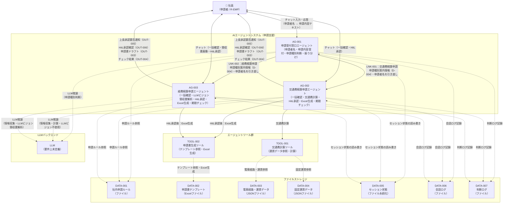

# システム構成図

> **参照元（業務要件定義資料）:**
> - 業務一覧.md（システム化対象業務の特定）
> - 業務プロセス定義.md（システム構成要素の役割・責務）
> - ユースケース定義.md（システム利用者・利用シーン）
> - 役割分担定義.md（システムと人の分担）

---

## 1. システム構成図

---

## 2. 矢印の凡例

| 矢印種別 | 意味 |
|---|---|
| 実線矢印（→） | 処理の委譲・呼び出し（制御フロー） |
| 破線矢印（-.->） | データの参照・取得（データフロー） |
| 双方向矢印（<-->） | 双方向通信（チャット入力・応答） |

---

## 3. システム構成の概要説明

本システムは3エージェント・振り分け型のマルチエージェントシステムです。外部システム連携は一切なく、すべての処理をシステム内部で完結します。

1. **AG-001（申請受付窓口）**：社員から申請者名と申請内容を受け取り、申請種別を判断・提示した上で適切な専門エージェントへ振り分ける
2. **AG-002（交通費精算申請）**：交通費精算申請の全フローを担当。必須項目を一括確認で収集し、TOOL-001で交通費計算後、HitL承認（OK/修正/キャンセル）を実施してTOOL-002でExcel生成・申請期限チェックまでを完結する
3. **AG-003（経費精算申請）**：経費精算申請の全フローを担当。必須項目を一括確認で収集し、LLMビジョンで領収書解析後、HitL承認（OK/修正/キャンセル）を実施してTOOL-002でExcel生成・申請期限チェックまでを完結する

各エージェントは共通のLLMバックエンドを使用し、ファイルストレージを通じてデータを管理します。申請書の最終提出はシステム外で社員が行います。
