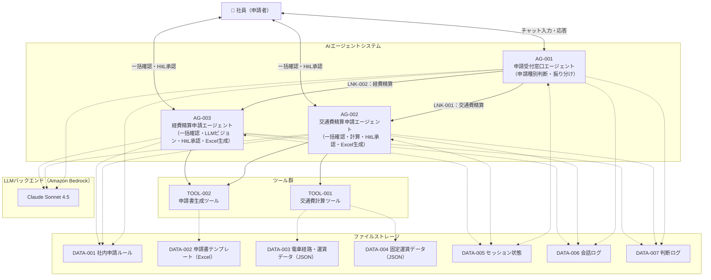

# システム基本情報

> **参照元（システム要件定義資料）:**
> - エージェント一覧.md（エージェント一覧・役割の特定）
> - 機能ツール一覧.md（ツール一覧・目的の特定）
> - システム構成図.md、システム構成図の構成要素一覧.md（システム構成図・アーキテクチャ概要）
> - 機能要件一覧.md（主な機能の特定）
> - データ一覧.md、テーブル一覧.md（データストアの特定）
> - 外部システム機能一覧.md（外部サービスの特定）

> 文書ID：`SYS-INFO-001`
> 文書名：システム基本情報
> 版数：`v1.0`
> 作成日：2026-07-03


---

## 1. システム概要

### 1.1 システム名称

**システム名**: 申請支援AIエージェントシステム

**英語名**: Application Support AI Agent System

**略称**: ASAAS

### 1.2 システムの目的・役割

**目的**:
- 社員が交通費精算申請・経費精算申請を行う際の申請種別判断・情報収集・申請書作成を自動化し、申請業務の効率化を実現する
- 申請ルールに基づいた申請内容の事前チェックにより、申請不備を事前に検出して申請の品質を向上させる
- AIエージェントによる対話型インタフェースで、申請者の負担を軽減する

**役割**:
- 申請者名と申請内容テキストから申請種別（交通費精算申請 / 経費精算申請）を判断し、適切な専門エージェントへ振り分ける
- 申請に必要な必須項目を一括確認で収集し、交通費計算・領収書画像解析を自動実行する
- HitL承認（OK/修正/キャンセル）を経て申請書ドラフト（Excelファイル）を生成する
- 申請ルール照合・申請期限チェックにより申請内容の事前チェック結果を社員に提示する


---

## 2. システム構成図

### 2.1 アーキテクチャ概要

本システムは、Agent As Tools 方式の階層型マルチエージェントシステムを採用しています。

**階層構造**:
1. オーケストレーター層：AG-001（申請受付窓口エージェント）が申請種別を判断し専門エージェントへ振り分ける
2. 専門エージェント層：AG-002（交通費精算申請エージェント）・AG-003（経費精算申請エージェント）が各申請種別の全フローを担当する
3. ツール・データ層：TOOL-001・TOOL-002がファイルストレージ（JSON/Excel）を参照して業務ロジックを実行する


### 2.2 システム構成図（Mermaid）



### 2.3 コンポーネント間の依存関係

| 依存元 | 依存先 | 依存内容 |
|---|---|---|
| AG-001 | AG-002, AG-003 | Agent As Tools 方式による委譲（申請種別確定後） |
| AG-002 | TOOL-001 | 交通費計算 |
| AG-002, AG-003 | TOOL-002 | HitL承認後の申請書（Excel）生成 |
| AG-001, AG-002, AG-003 | DATA-001 | 申請ルール参照 |
| TOOL-001 | DATA-003, DATA-004 | 運賃データ参照 |
| TOOL-002 | DATA-002 | 申請書テンプレート参照 |
| AG-001, AG-002, AG-003 | Amazon Bedrock / Claude Sonnet 4.5 | LLM推論 |

---

## 3. 技術スタック

### 3.1 開発環境

| 項目 | 内容 |
|-----|------|
| OS | ローカルPC（Windows / macOS / Linux） |
| シェル | CLIを使用してエージェントと対話する |
| 言語 | Python 3.x |
| IDE | 要件上未定義 |

### 3.2 LLM

| 項目 | 内容 |
|-----|------|
| LLMサービス | Amazon Bedrock |
| モデル | Claude Sonnet 4.5 |
| 認証 | AWS認証情報（boto3 / botocore） |
| リージョン | 要件上未定義 |


### 3.3 フレームワーク・ライブラリ

| 項目 | 内容 | 用途 |
|-----|------|------|
| strands-agents v1.25.0 | AWS Strands Agents | マルチエージェント・オーケストレーション |
| strands-agents-tools | AWS Strands Agents Tools | エージェント共通ツール群 |
| strands-agents-builder | AWS Strands Agents Builder | エージェント構築補助 |
| pydantic v2+ | Pydantic | 入力・状態モデルのデータバリデーション |
| openpyxl | openpyxl | 経費申請書のExcelファイル生成 |
| boto3 / botocore | AWS SDK | Amazon Bedrockアクセス |
| Pillow | Pillow | 領収書読み取り用画像処理（strands_tools image_reader の間接依存） |
| python-dotenv | python-dotenv | 環境変数管理 |
| python-dateutil | python-dateutil | 日付解析 |

### 3.4 外部サービス

| サービス | 用途 |
|---------|------|
| Amazon Bedrock | LLM推論（Claude Sonnet 4.5） |

> **注記**: 外部システム連携は Amazon Bedrock のみ。申請ルール・テンプレート・運賃データはすべて内部ファイルで管理する。

---

## 4. ディレクトリ構造

```
申請支援AIエージェントシステム/
├── main.py                        # エントリーポイント
├── config/
│   └── model_config.py            # モデル設定（Amazon Bedrock / Claude Sonnet 4.5）
├── agents/
│   ├── reception_agent.py         # AG-001 申請受付窓口エージェント
│   ├── transport_agent.py         # AG-002 交通費精算申請エージェント
│   └── expense_agent.py           # AG-003 経費精算申請エージェント
├── tools/
│   ├── transport_calculator.py    # TOOL-001 交通費計算ツール
│   └── application_generator.py  # TOOL-002 申請書生成ツール
├── handlers/                      # ハンドラー（バリデーション・閾値チェック等）
├── session/
│   └── session_manager.py         # セッションマネージャ（ファイル永続化）
├── data/
│   ├── rules/                     # DATA-001 社内申請ルール
│   ├── templates/                 # DATA-002 申請書テンプレート（Excel）
│   ├── fares/
│   │   ├── train_fares.json       # DATA-003 電車経路・運賃データ
│   │   └── fixed_fares.json       # DATA-004 固定運賃データ
│   └── sessions/                  # DATA-005 セッション状態（ファイル）
├── logs/
│   ├── conversation/              # DATA-006 会話ログ
│   └── decision/                  # DATA-007 判断ログ
└── outputs/                       # 生成された申請書ドラフト（Excel）
```


---

## 5. エージェント一覧

| エージェントID | エージェント名 | 実装識別子 | 役割 | 基本設計書 |
|--------------|--------------|----------|------|-----------|
| AG-001 | 申請受付窓口エージェント | reception_agent | 申請種別判断・申請書提示・専門エージェントへの振り分け（BIZ-01） | AG-001基本設計書 |
| AG-002 | 交通費精算申請エージェント | transportation_expense_agent | 交通費精算申請全フロー（一括確認・計算・HitL承認・Excel生成・期限チェック） | AG-002基本設計書 |
| AG-003 | 経費精算申請エージェント | general_expense_agent | 経費精算申請全フロー（一括確認・LLMビジョン・HitL承認・Excel生成・期限チェック） | AG-003基本設計書 |

**詳細**: 各エージェントの詳細仕様は基本設計書を参照してください。

---

## 6. ツール一覧

| ツールID | ツール名 | 目的 | 基本設計書 |
|---------|---------|------|-----------|
| TOOL-001 | 交通費計算ツール | 移動経路情報から運賃データを参照して交通費を計算する | TOOL-001基本設計書 |
| TOOL-002 | 申請書生成ツール | 収集済み申請情報を申請書テンプレート（Excel）にマッピングして申請書ドラフトを生成する | TOOL-002基本設計書 |

**詳細**: 各ツールの詳細仕様は基本設計書を参照してください。

---

## 7. 共通コンポーネント一覧

| コンポーネントID | コンポーネント名 | 目的 | 基本設計書 |
|----------------|----------------|------|-----------|
| SM-001 | セッションマネージャ | 申請フローのセッション状態をファイルに永続化し、resume可能にする | セッションマネージャ基本設計書 |
| HD-001 | ハンドラー群 | バリデーション・閾値チェック・対話回数管理・エラー処理等の共通処理 | ハンドラー基本設計書 |
| LG-001 | ログ出力モジュール | 会話ログ・判断ログをファイルに記録する | ログ出力方式設計 |

**詳細**: 各コンポーネントの詳細仕様は基本設計書を参照してください。

---

## 8. データストア

### 8.1 データファイル

| ファイル名 | 内容 | 形式 | パス |
|----------|------|------|------|
| 社内申請ルール（DATA-001） | 申請種別ごとの適用条件・申請先・必須項目・チェック基準 | テキスト/ドキュメント | data/rules/ |
| 申請書テンプレート（DATA-002） | 交通費精算・経費精算申請書の雛形（セル位置定義含む） | Excel（.xlsx） | data/templates/ |
| 電車経路・運賃データ（DATA-003） | 電車の経路テーブル（出発駅・到着駅・運賃） | JSON | data/fares/train_fares.json |
| 固定運賃データ（DATA-004） | バス・タクシー・飛行機の固定運賃 | JSON | data/fares/fixed_fares.json |

### 8.2 出力ファイル

| ディレクトリ | 内容 | 形式 | パス |
|------------|------|------|------|
| 申請書ドラフト | 社員への申請書ドラフト（Excel生成物） | Excel（.xlsx） | outputs/ |

### 8.3 ストレージ

| ディレクトリ | 内容 | 形式 | パス |
|------------|------|------|------|
| セッション状態（DATA-005） | 申請フロー進行状態（ファイル永続化・resume対応） | JSON | data/sessions/ |
| 会話ログ（DATA-006） | 申請フロー全体の会話内容記録（マスキング対象） | 構造化データ | logs/conversation/ |
| 判断ログ（DATA-007） | エージェントの判断内容・適用ルール・根拠の記録 | 構造化データ | logs/decision/ |

---

## 9. ターゲットユーザー

**主要ユーザー**: 社員（申請者）

**ユーザー特性**:
- 交通費精算申請・経費精算申請を行う社員全般
- CLIチャットインタフェースを通じてエージェントと対話する

**申請者情報の取得タイミング**:
- 申請者名はアプリケーション起動時（対話ループ開始前）に取得し、エージェントの初期化パラメータとして渡す
- 申請日はユーザーとの対話で収集するのではなく、システム日付（実行時の日付、YYYY-MM-DD形式）を自動取得する

---

## 10. 主な機能

### 10.1 申請受付・振り分け機能

1. 申請者名と申請内容テキストから申請種別を判断する（FR-001）
2. 申請書名・申請先・判断根拠を社員に提示し、専門エージェントへ振り分ける（FR-002）

### 10.2 申請情報収集・処理機能

1. 申請必須項目を一括確認で収集する（FR-003）
2. 領収書画像から購入日・店舗名・品目・金額を自動抽出する（FR-004）
3. 経費区分を品目から自動判断する（FR-005）
4. 移動経路情報から交通費を自動計算する（FR-006）

### 10.3 申請書作成・チェック機能

1. HitL承認（OK/修正/キャンセル）を経て申請書ドラフト（Excel）を生成する（FR-008）
2. 申請内容を申請ルールと照合し不備を検出・通知する（FR-009）
3. 申請期限（経費発生日から3ヶ月以内）を超過した場合に通知する（FR-010）

### 10.4 共通機能

1. 会話状態管理（セッション管理・resume対応）
2. 入力バリデーション（必須項目・文字数500文字制限）
3. 対話回数上限管理（30回上限）
4. エラー処理・エスカレーション案内

---

## 11. 技術的特徴

### 11.1 Agent As Tools 方式の階層型マルチエージェント

- AG-001がオーケストレーターとして申請種別を判断し、AG-002/AG-003を Tools として呼び出す
- 各専門エージェントが申請種別ごとの全フローを自己完結し、責務の分離とテスト容易性を確保する

### 11.2 ファイルベース参照（外部システム連携なし）

- 申請ルール・テンプレート・運賃データをファイルで管理し、LLMが直接参照する（RAG不使用）
- 外部API・外部OCRサービスを使用せず、機微情報の外部送信リスクを排除する

---

## 12. 制約事項

### 12.1 技術的制約

- LLM推論精度はモデル（Claude Sonnet 4.5）の性能に依存する
- 領収書画像解析の精度は画像品質・角度に依存し、100%保証はできない（解析不能時は手動入力にフォールバック）

### 12.2 業務的制約

- 申請書の最終提出はシステム外で社員が行う（システムは申請書ドラフト生成まで担当）
- 申請先情報は要件上未定義

### 12.3 運用的制約

- セッション状態・ログはファイルに保存する（RDB・揮発性ストレージは使用しない）
- すべてのデータ（セッション状態・ログ・申請書ドラフト・運賃データ等）はローカルPCの所定フォルダにファイルで格納する
- 1回の申請フローにおける対話回数上限は30回

---

## 13. 今後の拡張予定

### 13.1 機能拡張

- 申請種別の追加（社内申請ルールファイルへの追記で対応可能な設計とする）

### 13.2 技術的拡張

- LLMモデルの変更・バージョンアップ（model_config.py の変更のみで対応可能）

---

## 14. 関連ドキュメント

| ドキュメント名 | パス |
|-------------|------|
| 基本設計書（エージェント） | artifacts/04_basic-design/outputs/ |
| 基本設計書（ツール） | artifacts/04_basic-design/outputs/ |
| 基本設計書（共通） | artifacts/04_basic-design/outputs/ |
| 詳細設計書 | artifacts/05_detailed-design/outputs/ |
| システム設計書 | artifacts/03_system-design/outputs/ |

---

## 15. 変更履歴

| 日付 | 版 | 変更内容 | 担当 |
|-----|---|---------|------|
| 2026-07-03 | v1.0 | 初版作成 | - |

---
