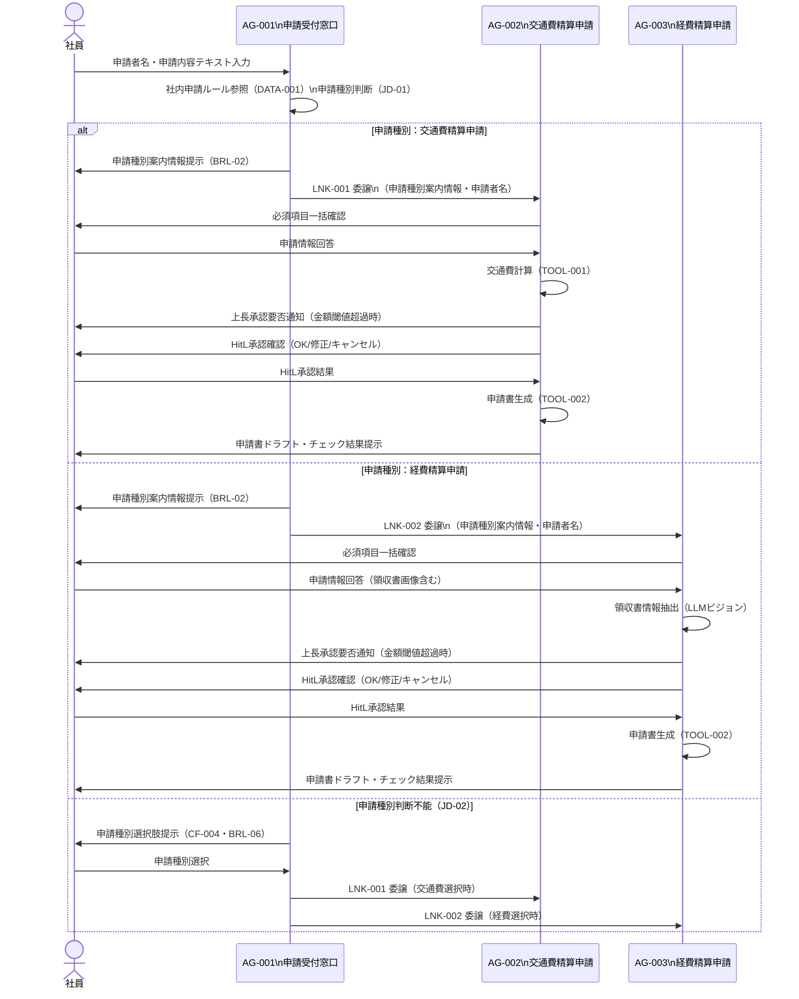

# マルチエージェント連携設計書

> **参照元（システム要件定義資料）:**
> - エージェント一覧.md（エージェント役割・責務・自律度の特定）
> - エージェント間連携定義.md（連携方式・連携ポリシー・連携フロー）
> - 会話フロー一覧.md（連携が発生する会話フロー・タイミング）
> - 機能要件一覧.md（連携が必要な機能の特定）
> - 自律度・権限定義.md（エージェントの権限境界・判断権限）
> - データ一覧.md（共有コンテキスト・状態情報の特定）

> 文書ID：`SYS-MA-001`
> 文書名：マルチエージェント連携設計書
> 版数：`v1.0`
> 作成日：2026-07-03


---

## 1. 目的・適用範囲

### 1.1 目的

本設計書では、以下を定義します:
- エージェント間の委譲方式
- ルーティング方式
- 通信契約（エージェント間メッセージ）
- 協調パターン

本設計書では、以下は定義しません（別紙参照）:
- 詳細な例外処理（例外処理方針参照）
- セッション保持（セッション管理方針参照）
- 権限設計（自律度・権限定義参照）

### 1.2 適用範囲

**対象システム**: 申請支援AIエージェントシステム（ASAAS）

**対象エージェント**:
- AG-001（申請受付窓口エージェント）：オーケストレーター
- AG-002（交通費精算申請エージェント）：専門エージェント
- AG-003（経費精算申請エージェント）：専門エージェント


---

## 2. 用語・前提

### 2.1 用語

| 用語 | 定義 |
|-----|------|
| オーケストレーション | AG-001が申請種別を判断し、適切な専門エージェントに処理を委譲すること |
| ルーティング | 申請内容テキストと社内申請ルールの照合結果に基づき、委譲先エージェントを決定すること |
| 委譲（Delegation） | AG-001が申請フローの全処理を AG-002 または AG-003 に丸投げする方式。Agent As Tools として実現する |
| エージェント間メッセージ | 委譲時に AG-001 から専門エージェントに渡す業務コンテキスト（申請種別案内情報・申請者名） |
| セッションID | 申請フロー1件を一意に識別するID。セッション状態ファイル（DATA-005）に紐付く |
| HitL（Human in the Loop） | Excel生成前に申請情報サマリーを社員に提示し、OK/修正/キャンセルの承認を求める処理 |

### 2.2 前提・制約

**同期/非同期の前提**:
- 全連携は同期（リクエスト/レスポンス型）で処理する
- AG-001から専門エージェントへの委譲はAgent As Tools方式で同期呼び出しを行う

**外部I/Fの制約**:
- 外部システム連携なし。すべての処理はシステム内部で完結する

**運用・監査上の制約**:
- エージェント間の委譲は会話ログ・判断ログに記録する
- 循環呼び出し禁止（AG-002/AG-003からAG-001への逆委譲禁止）

---

## 3. 連携アーキテクチャ（協調パターン）

### 3.1 採用する協調パターン

採用パターン：**Agent As Tools 方式の階層（Manager-Worker）型**

AG-001がオーケストレーターとして機能し、AG-002・AG-003をToolsとして登録・呼び出す。


### 3.2 採用理由・非採用理由

**採用理由**:
- 申請種別（交通費精算 / 経費精算）は排他的であり、1申請フローでは常に1つの専門エージェントのみが実行されるため、階層型が適合する
- Agent As Tools により、AG-001 が専門エージェントを直接呼び出せ、Strands Agents フレームワークの標準的な実装パターンに則っている
- AG-002・AG-003 がそれぞれ自己完結した申請フローを担当するため、責務が明確で保守性が高い

**非採用理由**:
- ピア（Peer-to-Peer）型：申請フローは申請種別ごとに独立しており、並行協調は不要
- ハイブリッド型：連携パターンが単純（1対1委譲のみ）であるため、複合パターンは不要

### 3.3 連携の基本原則（設計ルール）

**単一責任**:
- AG-001：申請種別判断・申請書提示・委譲のみを担当する
- AG-002：交通費精算申請の全フロー（情報収集・計算・HitL承認・Excel生成・期限チェック）のみを担当する
- AG-003：経費精算申請の全フロー（情報収集・LLMビジョン・HitL承認・Excel生成・期限チェック）のみを担当する

**委譲の粒度**:
- 委譲は「申請種別の全フロー」単位（タスク丸投げ）で行う
- ステップ単位の細粒度委譲は行わない

**"判断"と"実行"の分離**:
- 申請種別の判断（JD-01/JD-02）はAG-001が担当する
- 判断確定後の実行（情報収集・計算・生成・チェック）は専門エージェントが担当する

**冪等性・再実行可能性**:
- セッション状態（DATA-005）をファイルに永続化することで、障害発生時のresume（再開）を可能にする
- 委譲先エージェントは前回の進捗状態を参照して再開点から処理を継続できる

---

## 4. エージェント連携構成

### 4.1 エージェント一覧（連携観点）

| AG-ID | エージェント名 | 役割（連携観点） | 入力 | 出力 | 依存先 |
|-------|--------------|----------------|------|------|-------|
| AG-001 | 申請受付窓口エージェント | オーケストレーター：申請種別判断・ルーティング・委譲 | 申請者名, 申請内容テキスト（D-001）, 社内申請ルール（DATA-001） | 申請種別案内情報（D-004）, 委譲リクエスト（LNK-001 / LNK-002） | DATA-001（ファイル）, Amazon Bedrock |
| AG-002 | 交通費精算申請エージェント | 専門エージェント（交通費）：委譲受付・全フロー実行 | 申請種別案内情報（D-004）, 申請者名 | 申請書ドラフト（D-009）, チェック結果（D-010） | TOOL-001, TOOL-002, DATA-001〜004, Amazon Bedrock |
| AG-003 | 経費精算申請エージェント | 専門エージェント（経費）：委譲受付・全フロー実行 | 申請種別案内情報（D-004）, 申請者名 | 申請書ドラフト（D-009）, チェック結果（D-010） | TOOL-002, DATA-001〜002, Amazon Bedrock |


### 4.2 役割分類と責務

**司令塔（Orchestrator）**:
- **責務**: 申請者名と申請内容テキストを受け取り、社内申請ルールを参照して申請種別を判断し、該当する専門エージェントに申請フロー全体を委譲する
- **権限境界**: 申請種別判断と委譲のみ。情報収集・計算・申請書生成・チェックは行わない（最大自律度Lv2）

**専門エージェント**:
- **責務**: AG-001から受け取った申請種別案内情報と申請者名をもとに、申請フロー（情報収集・計算・HitL承認・Excel生成・期限チェック）を自己完結で実行する
- **依頼受付条件**: AG-001による申請種別確定後のみ（LNK-001またはLNK-002が発火した時点）


---

## 5. ルーティング設計（どのエージェントへ回すか）

### 5.1 ルーティング方式

採用方式：**ルールベース（判断基準表）+ 分類器（LLM intent分類）ハイブリッド**

社内申請ルール（DATA-001）のファイルを参照し、LLMが申請内容テキストの意図を分類して申請種別を判断する（JD-01）。判断不能時はルールベースで選択肢を提示する（JD-02）。


### 5.2 ルーティング判断基準表

| 条件（入力/状態） | ルーティング先 | 例 | 備考 |
|----------------|--------------|---|------|
| 申請内容テキストが交通費精算申請の条件に合致する（JD-01適用） | AG-002 | 「電車代を精算したい」「タクシー代の申請」 | LNK-001 発火 |
| 申請内容テキストが経費精算申請の条件に合致する（JD-01適用） | AG-003 | 「文房具を購入した経費を申請」「宿泊費の精算」 | LNK-002 発火 |
| 申請種別が判断不能（JD-02適用） | CF-004（選択肢提示） | 申請内容が両種別のいずれにも合致しない | 社員選択後にAG-002またはAG-003へ委譲 |


### 5.3 フォールバック方針

**判断不能時の扱い**:
- JD-02を適用し、選択肢（交通費精算申請 / 経費精算申請）を社員に提示する（CF-004）
- 社員が選択した結果で申請種別を確定し、対応する専門エージェントへ委譲する（BRL-06）

**低信頼時の扱い**:
- LLM判断の信頼度が低い場合は判断不能として扱い、選択肢提示（JD-02）を適用する

---

## 6. 委譲・協調設計（いつ・どう委譲するか）

### 6.1 タスク分割ルール

**分割単位**: 申請種別ごとの全フロー（1申請 = 1専門エージェントへの委譲）

**分割の上限**:
- 並列数: 1（1申請フローにつき1専門エージェントのみ実行）
- 深さ: 1（AG-001 → AG-002 または AG-001 → AG-003 の1段のみ）

**依頼テンプレ（エージェント間メッセージ）**:
```
AgentMessage(
  申請種別名（交通費精算申請 または 経費精算申請）,
  申請書名,
  申請先,
  判断根拠（参照ルール名）,
  申請者名
)
```
> ※ エージェント間メッセージで渡す業務コンテキストは上記項目のみとする
> ※ 上記以外の情報（会話履歴・セッション詳細等）はセッション管理方針の共有コンテキストで管理し、エージェント間メッセージには含めない

**invocation_state フィールド仕様**:

オーケストレーター（AG-001）→ 専門エージェント（AG-002/AG-003）へ ToolContext 経由で渡す invocation_state:

| フィールド | 内容 |
|----------|------|
| applicant_name | 申請者名 |
| application_date | 申請日（システム日付：YYYY-MM-DD形式） |
| session_id | セッションID |

専門エージェント（AG-002/AG-003）内部でエージェントに渡す invocation_state:

| フィールド | 内容 |
|----------|------|
| applicant_name | 申請者名 |
| application_date | 申請日（システム日付：YYYY-MM-DD形式） |

> **注意事項**
> - `session_id` はオーケストレーターから専門エージェントへの受け渡しには含めるが、専門エージェント内部では、セッションマネージャーの初期化に直接使用し、エージェントへの invocation_state には含めない
> - invocation_state は辞書リテラルで渡す。専用の Pydantic モデルは定義しない
> - `session_id` はツール関数の引数に含めない


### 6.2 委譲条件（Delegation Policy）

| 条件 | 委譲先候補 | 優先順位 | 禁止条件 |
|-----|----------|---------|---------|
| 申請種別「交通費精算申請」確定（JD-01） | AG-002 | 1 | AG-001が情報収集・計算・生成を行うことは禁止 |
| 申請種別「経費精算申請」確定（JD-01） | AG-003 | 1 | AG-001が情報収集・計算・生成を行うことは禁止 |
| 申請種別判断不能（JD-02）→ 社員選択後 | AG-002 または AG-003 | 1 | 社員の選択確定前に委譲してはならない |

### 6.3 並列・逐次の決定ルール

**並列可能条件**: なし（1申請フローにつき1専門エージェントのみ；並列委譲は発生しない）

**逐次必須条件**: 申請種別確定 → 専門エージェント委譲 の順序は必須

**排他対象**:
- AG-002とAG-003の同時実行禁止（1申請フローに対し一方のみ実行する）
- AG-002/AG-003からAG-001への逆委譲禁止

---

## 7. エージェント間通信設計（契約）

### 7.1 メッセージ種別

| 種別 | 目的 | 必須フィールド |
|-----|------|--------------|
| 委譲リクエスト（Delegation Request） | AG-001から専門エージェントへ申請フローを委譲する | 申請種別名, 申請者名, 申請書名, 判断根拠 |


### 7.2 エージェント間メッセージスキーマ

**オーケストレーター（AG-001） → 専門エージェント（AG-002 / AG-003）**:
```
{
  申請種別名: 交通費精算申請 または 経費精算申請,
  申請書名: <申請書の名称>,
  申請先: <申請先部門（要件上未定義）>,
  判断根拠: <参照した申請ルール名>,
  申請者名: <申請者の氏名>
}
```

**専門エージェント → サブエージェント**:
```
（サブエージェントは存在しない。ツール呼び出しはエージェント→ツールの関係で実現する）
```
> ※ 具体的な型・バリデーション制約はデータモデル基本設計書で定義する（本設計書はフィールド構成のみ確定する）


### 7.3 共有コンテキスト設計（連携観点）

**共有する情報**:
- 申請者名（AG-001で収集 → AG-002/AG-003に引き継ぐ）
- 申請種別案内情報（D-004）（AG-001で生成 → AG-002/AG-003に引き継ぐ）

**共有しない情報**:
- 会話履歴（各エージェントが独立して管理する）
- 内部処理状態（セッション管理方針で定義するセッションファイルで管理）

**参照方法**:
- エージェント間メッセージ（委譲リクエスト）として渡す

**更新ルール**:
- AG-001が申請種別を確定した時点で申請種別案内情報（D-004）を生成し、委譲リクエストに含める
- 委譲後の状態更新はAG-002/AG-003がセッション状態ファイル（DATA-005）に書き込む


---

## 8. 状態引き継ぎ（連携観点）

### 8.1 必須の状態情報（連携に必要）

| 状態キー | 用途 | 更新主体 | 保存期間 |
|---------|------|---------|---------|
| 申請者名 | AG-001で収集し AG-002/AG-003 に引き継ぐ | AG-001 | セッション終了まで |
| 申請種別案内情報（D-004） | AG-001で生成し AG-002/AG-003 が参照する | AG-001 | セッション終了まで |
| 現在の担当エージェントID | 委譲後の処理主体を記録する | AG-001（委譲時）| セッション終了まで |


### 8.2 再開（Resume）設計

**中断からの再開条件**:
- セッション状態ファイル（DATA-005）が存在する場合、前回の中断箇所から再開可能

**再開時の優先順位**:
- セッション状態ファイルの「現在の担当エージェントID」と「現在ステップ」を参照し、当該エージェントが該当ステップから処理を継続する

---

## 9. 連携フロー定義（ユースケース別）

### 9.1 ユースケース一覧

| UC-ID | 名称 | 主担当（起点） | 参加エージェント | 備考 |
|-------|-----|--------------|----------------|------|
| CF-001 | 申請受付・振り分け | AG-001 | AG-001 → AG-002 または AG-003 | LNK-001 / LNK-002 発火 |
| CF-002 | 交通費精算申請フロー | AG-002 | AG-002 | AG-001からの委譲後 |
| CF-003 | 経費精算申請フロー | AG-003 | AG-003 | AG-001からの委譲後 |
| CF-004 | 申請種別判断不能時の選択肢提示 | AG-001 | AG-001 | JD-02適用時 |
| CF-005 | 上長承認要否通知 | AG-002 / AG-003 | AG-002 または AG-003 | 金額閾値超過時 |

### 9.2 連携フロー（Mermaid）



### 9.3 連携フロー（例外系の分岐ポイント）

**失敗しうるステップ**:
1. AG-001の社内申請ルール参照失敗（DATA-001ファイルアクセスエラー）
2. AG-002の交通費計算失敗（TOOL-001：経路テーブル検索失敗）
3. AG-002/AG-003の申請書生成失敗（TOOL-002：テンプレートファイル参照失敗）
4. AG-003の領収書画像解析失敗（LLMビジョン）

**失敗時の戻り先**:
- 再試行: ファイル参照失敗 → エラー通知後に担当部門へのエスカレーション案内
- 再ルーティング: 交通費計算失敗 → 社員に手動入力を促し情報収集ステップへ戻る
- エスカレーション: 申請書生成失敗 → 社員にエラーを通知し担当部門への問い合わせを案内

---

## 10. 依存関係・循環防止ルール

### 10.1 依存関係（DAG）

| From | To | 目的 | 循環禁止ルール |
|------|---|------|--------------|
| AG-001 | AG-002 | 交通費精算申請フロー全体の委譲（LNK-001） | AG-002からAG-001への逆委譲禁止 |
| AG-001 | AG-003 | 経費精算申請フロー全体の委譲（LNK-002） | AG-003からAG-001への逆委譲禁止 |
| AG-002 | TOOL-001 | 交通費計算 | ツールからエージェントへの逆依存禁止 |
| AG-002, AG-003 | TOOL-002 | 申請書（Excel）生成 | ツールからエージェントへの逆依存禁止 |

### 10.2 循環防止・暴走防止

**最大委譲深さ**: 1（AG-001 → AG-002 または AG-001 → AG-003 の1段のみ）

**最大ループ回数**: 対話回数30回上限（FR-012）。30回到達時に処理終了通知を行う

**タスク再発行のクールダウン**: なし（同一申請フロー内での再委譲は発生しない設計）

**監視指標**:
- 対話回数（最大30回）をセッション状態（DATA-005）で管理する
- 委譲回数（1申請フローにつき1回のみ）を判断ログ（DATA-007）に記録する


---

## 11. インタフェース境界（他成果物との切り分け）

### 11.1 本設計書の責務

- AG-001から専門エージェントへの委譲方式・タイミング・データの定義
- ルーティング判断基準の定義
- エージェント間メッセージの概念レベルのフィールド構成の定義
- 循環防止ルール・委譲深さ上限の定義

### 11.2 他成果物へ委譲する責務（参照）

- 実行制御（再試行、タイムアウト等）: 実行制御方針
- セッション管理: セッション管理方針
- 例外処理: 例外処理方針
- エスカレーション: 例外処理方針
- 権限／承認: 自律度・権限定義
- ガードレール: ガードレール処理方式設計
- ログ: ログ出力方式設計

---

## 12. 設計上の決定事項（Decision Log）

| ID | 決定事項 | 理由 | 影響範囲 | 代替案 |
|----|---------|------|---------|-------|
| DEC-001 | Agent As Tools 方式を採用する | Strands Agents フレームワークの標準的な実装パターンであり、AG-001が専門エージェントを直接呼び出せる | AG-001, AG-002, AG-003 | サブグラフ方式 |
| DEC-002 | 委譲粒度を「申請種別の全フロー」単位にする | ステップ単位の細粒度委譲はオーバーエンジニアリングであり、専門エージェントが自己完結できる | AG-001, AG-002, AG-003 | ステップ単位委譲 |
| DEC-003 | AG-002とAG-003の並列実行を禁止する | 1申請フローは1申請種別であるため、並列実行は不要かつセッション管理の複雑化を招く | AG-001 | 並列委譲 |

---

## 13. 未決事項・リスク

| ID | 未決事項/リスク | 影響 | 対応案 | 期限 |
|----|---------------|------|-------|------|
| RISK-001 | 申請先情報が要件上未定義 | 委譲リクエストの申請先フィールドが空になる | 要件確定後にフィールドを補完する | 要件上未定義 |
| RISK-002 | 委譲タイムアウト値が要件上未定義 | 専門エージェントの処理が長時間化した場合の上限が不明 | 実行制御方針で定義する | 実行制御方針策定時 |

---

## 14. 変更履歴

| 日付 | 版 | 変更内容 | 変更者 |
|-----|---|---------|-------|
| 2026-07-03 | v1.0 | 初版作成 | - |

---
